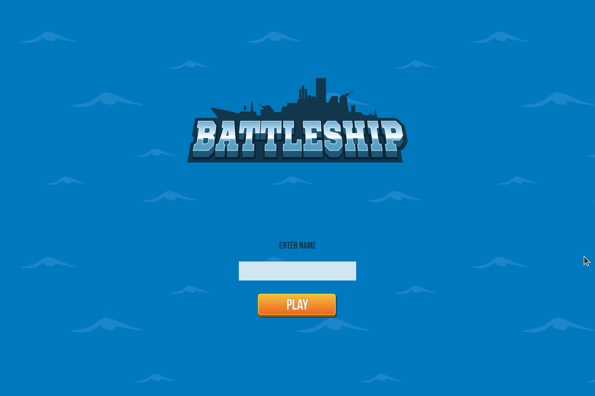
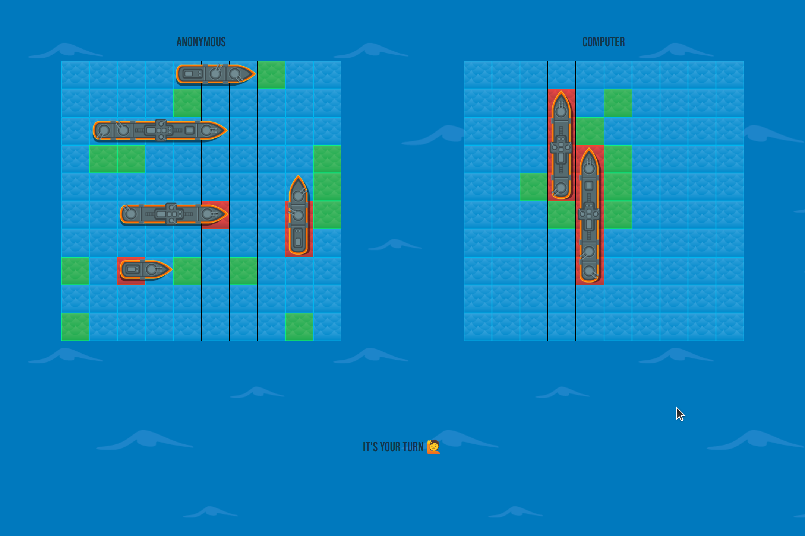

[](https://www.theodinproject.com/lessons/node-path-javascript-battleship)


# Battleship

Battleship game web app.

## Demo

<p align="center">
  
</p>
<p align="center">
  
</p>
<h2 align="center">
  <a href="https://amadeu-io.github.io/battleship">👉 Demo</a>
</h2>

## Features

The app has been built to be very user friendly.

**Ship Placements**

- Random shuffle as much as you want
- Drag-and-drop for positioning
- Click to switch orientation
- If a ship is placed on an invalid position, instead of throwing an error or not doing anything, the UI cleverly places it in a close valid position available

**Quick Start**

- Start playing in seconds with just two Enter key presses using the initial random ship shuffle

**Visual UI**

- Animations and disctintive colors for the different events make the game easy to follow and understand

**Responsiveness**

- Adapts to various screen sizes: desktop, tablet and mobile.

## Tech Stack

- **Languages:** TypeScript, CSS, HTML
- **Build Tool:** Vite
- **Interaction Dependencies:** interact.js
- **Testing Framework:** Jest

## File Structure

- `/src`: Contains the source code
  - `/src/styles`: CSS styles
  - `/src/ts/classes`: TypeScript classes
  - `/src/ts/main.ts`: Main functionality of the app with class usage and DOM manipulaton
- `/docs`: Distribution files generated during the build, GitHub pages is reading the root of this directory

- `/public`: Images, sprites and font

- `index.html`: Entry point for the Vite app during development with dynamic injection of TypeScript and CSS

## Classes

The project utilizes several TypeScript classes to organize data and encapsulate functionality.

### 1. `Ship` Class:

Represents each ship.

**Properties**

- `name`
- `length`
- `position`
- `orientation`
- `hits`
- `sunk`
- `coordinates`

**Methods**

- `hit()`: Increments the number of hits on the ship

- `isSunk()`: Returns a boolean indicating whether the ship is sunk

- `get coordinates()`: Getter method that computes coordinates based on lenght, position and orientation

- `clone()`: Creates a duplicate instance of the `Ship` class with the same properties

### 2. `Player` Class:

Represents each player.

**Properties**

- `role`
- `board`
- `ships`
- `death`

**Main Methods**

- `placeShip(ship)`: Adds a ship to `ships`

- `moveShip(ship, newPosition)`: Changes the position of a ship, if valid

- `moveToClosestValidPosition(ship, desiredPosition)`: It's `moveShip` on steroids. If the desired position is not valid, it explores close positions and places the ship as soon as it finds one. It also returns a boolean indicating if the valid position was found.

- `switchShipOrientation(ship)`: Switches the orientation of a ship, if the switch results in an invalid placement, moves the ship to a close valid position by calling `moveToClosestValidPosition`

- `syncShipsToBoard()`: Updates the `board` with the data in `ships`

- `createAttack(position)`: Adds an attack to both `ships` and `board`

- `async createDelayedRandomUnrepAttack()`: Creates a delayed random unrepeated attack used by the computer. The delay improves the UX by giving the impression the computer is 'thinking'

- `populateRandomly()`: Randomly populates the player's `ships`

- `isInvalidPlacement(candidateShip)`: Checks if a ship is in an invalid position (i.e. overlaps with other ships or goes out of bounds). This method is crucial for the correct functioning of `moveToClosestValidPosition` and `populateRandomly`

### 3. `playerRenderer` Class:

Serves as a bridge between `player` and the UI.

**Properties**

- `player`
- `htmlBoard`
- `htmlCells`
- `htmlShips`
- `cellSize`

**Main Methods**

- `createBoard()`: Creates a 10x10 board of `htmlCells` appended to `htmlBoard`

- `renderAttacks()`: Renders the state of `player.board` on `htmlBoard`, setting the right color for each cell based on its hit status

- `renderAttackAnimation(position)`: Renders an attack animation at the specified position

- `renderShip(ship)`: Renders a `ship` on the board with an HTML ship image

- `addInteract(htmlShip)`: Adds drag-and-drop and click interaction to an HTML ship element using the `interact.js` library. It reads the result of the interaction and updates the data in `player`, ensuring it's always in sync with the UI

- `removeInteractToAll()`: Removes interaction from all HTML ship elements. Crucial for when the game starts

- `setCellSize()`: Sets and returns the cell size based on the window width for responsive design

## Run Locally

Clone the project

```bash
  git clone https://github.com/amadeu-io/battleship
```

Go to the project directory

```bash
  cd battleship
```

Install dependencies

```bash
  npm install
```

Start the server

```bash
  npm run dev
```

## Acknowledgements

- [Assets by redfoc](https://graphicriver.net/item/battleship-game-kits/26807537/)
- [GPT](https://chat.openai.com/)
- [readme.so](https://readme.so/)
- [shields.io](https://shields.io/)

## License

[MIT](https://choosealicense.com/licenses/mit/)
